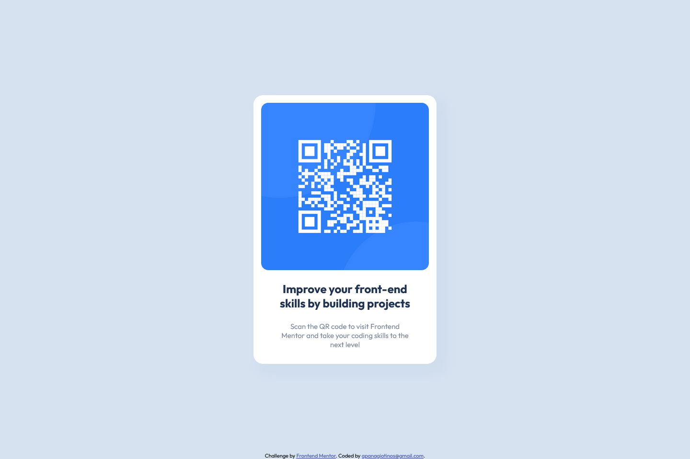
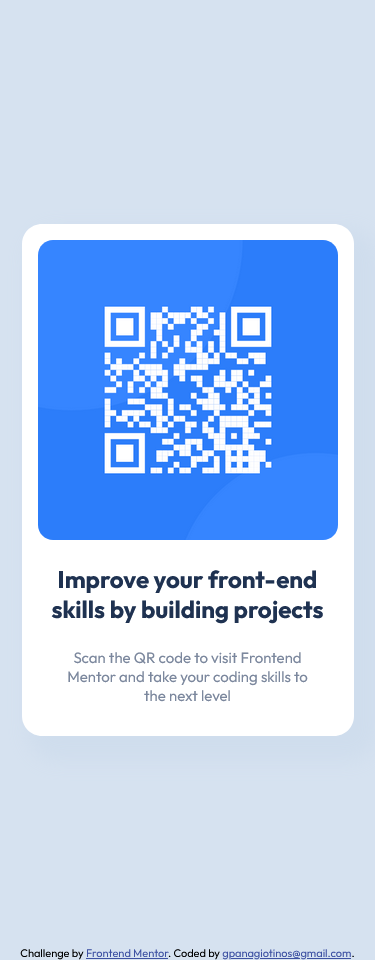

# Frontend Mentor - QR code component solution

This is a solution to the [QR code component challenge on Frontend Mentor](https://www.frontendmentor.io/challenges/qr-code-component-iux_sIO_H). Frontend Mentor challenges help you improve your coding skills by building realistic projects.

## Table of contents

- [Frontend Mentor - QR code component solution](#frontend-mentor---qr-code-component-solution)
  - [Table of contents](#table-of-contents)
  - [Overview](#overview)
    - [Screenshot](#screenshot)
    - [Links](#links)
  - [My process](#my-process)
    - [Built with](#built-with)
    - [What I learned](#what-i-learned)
    - [Continued development](#continued-development)
    - [Useful resources](#useful-resources)
  - [Author](#author)

**Note: Delete this note and update the table of contents based on what sections you keep.**

## Overview

### Screenshot





### Links
- Live Site URL: [QR Code Fontend Mentor](https://gpanagiotinos.github.io/qr-code-frontend-mentor/)
- Github Repo URL: [Repository](https://github.com/gpanagiotinos/qr-code-frontend-mentor)

## My process

### Built with

- Semantic HTML5 markup
- CSS custom properties and classes
- CSS Flexbox
- CSS Box Shadow
- CSS Media Queries
- Google Fonts APIs

### What I learned

I undertook this challenge with the primary aim of mastering CSS Flexbox. My focus was on learning how to declare a container, align its children, and distribute them along either a single axis or both. By grasping the concepts of the main and cross axes in Flexbox, I acquired the ability to seamlessly craft layouts that adapt to various screen sizes and orientations. Additionally, I implemented a straightforward media query to adjust the width of the QR code card, adding another layer of responsiveness to the design.

```css
body {
  background-color: hsl(212, 45%, 89%);
  font-family: "Outfit";
  min-height: 100vh;
  height: 100%;
  max-width: 1440px;
  margin: 0 auto;
  display: flex;
  justify-content: center;
  align-items: center;
  position: relative;
}
.card {
  background-color: hsl(0, 0%, 100%);
  padding: 1rem;
  display: flex;
  flex-direction: column;
  justify-content: center;
  align-items: center;
  text-align: center;
  border-radius: 20px;
  width: 350px;
  box-shadow: 15px 15px 20px 10px hsl(212, 45%, 87%);
}
@media screen and (max-width: 440px) {
  .card {
    width: 80%;
  }
  .title {
    padding: 0;
  }
  .subtitle {
    padding: 0 1.5rem 0 1.5rem;
  }
}
```

### Continued development


I am eager to further my understanding of both fundamental and advanced concepts in CSS and HTML, focusing on crafting layouts that exhibit responsiveness, modern aesthetics, efficiency with concise code, cleanliness, and user-friendliness.

### Useful resources

- [MDN Webdocs Flexbox Basics](https://developer.mozilla.org/en-US/docs/Web/CSS/CSS_flexible_box_layout/Basic_concepts_of_flexbox) - This helped me for basic understanding of css flexbox.


## Author

- Website - [Georgios Panagiotinos](https://code.panagiotinos.com/)
- Frontend Mentor - [@gpanagiotinos](https://www.frontendmentor.io/profile/gpanagiotinos)
- Github - [@gpanagiotinos](https://github.com/gpanagiotinos)